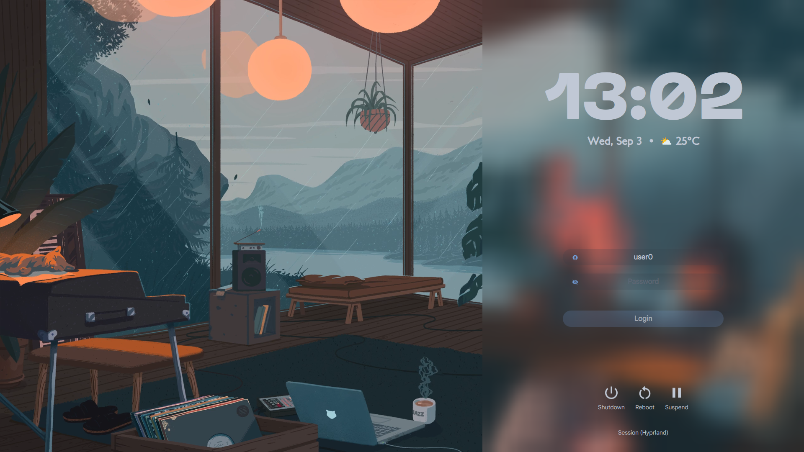

# 🏠 Dotfiles

A comprehensive Arch Linux dotfiles configuration featuring a modern Hyprland-based desktop environment with beautiful themes, productivity tools, and automated installation.

## 📸 Preview Gallery

### 🖥️ Desktop Themes

<div align="center">

**App Launcher**


**Theme Switcher**


**Color Matching**


</div>

### 🔐 Login Screen (SDDM)

<div align="center">


*Custom Vitreous SDDM theme with dynamic background*

</div>

## ✨ Features

### 🖥️ Desktop Environment
- **Window Manager**: Hyprland (Wayland compositor)
- **Status Bar**: Waybar with custom themes
- **Application Launcher**: Walker
- **Notifications**: SwayNC with custom themes
- **Display Manager**: SDDM with custom Vitreous theme
- **Terminal**: Kitty with theme integration

### 🎨 Theming & Aesthetics
- **Dynamic Color Generation**: Matugen for wallpaper-based theming
- **GTK Themes**: Multiple options (Catppuccin, Dracula, Tokyo Night, etc.)
- **Icon Theme**: Dark icon theme
- **Cursor Theme**: McMojave cursors
- **Wallpapers**: Curated collection of beautiful wallpapers
- **Font**: JetBrains Mono Nerd Font

### 🛠️ Development Tools
- **Editor**: Neovim with custom configuration
- **Shell**: Zsh with Zinit plugin manager
- **Prompt**: Starship with theme integration
- **Terminal Multiplexer**: Tmux
- **File Navigation**: Zoxide for smart directory jumping
- **Fuzzy Finder**: FZF with custom theming
- **System Monitor**: Btop
- **System Info**: Fastfetch with custom configuration

### 🔧 System Tools
- **Audio**: PipeWire with WirePlumber
- **Bluetooth**: Blueman
- **Network**: NetworkManager
- **File Manager**: Nautilus
- **PDF Viewer**: Okular
- **Image Viewer**: GPicview
- **Screenshot**: Hyprshot and Grim/Slurp
- **Wallpaper Manager**: SWWW

## 📦 Installation

### Prerequisites
- Fresh Arch Linux installation
- Internet connection
- User account with sudo privileges

### Quick Install
```bash
# Clone the repository
git clone https://github.com/yourusername/dotfiles.git ~/dotfiles
cd ~/dotfiles

# Run the installation script
./scripts/install.sh
```

### Test Installation (Recommended)
```bash
# Test the installation script without making changes
./scripts/test-install.sh

# Run in test mode to see what would be installed
TEST_MODE=true ./scripts/install.sh
```

## 🔧 Installation Steps

The installation script performs the following steps:

1. **Package Manager Setup**: Installs yay AUR helper if not present
2. **System Update**: Updates all system packages
3. **Package Installation**: Installs 120+ packages from `pkglist.txt`
4. **Service Configuration**: Enables NetworkManager, Bluetooth, and SDDM
5. **Dotfiles Setup**: Uses GNU Stow to symlink configurations
6. **Theme Setup**: Configures fonts, themes, and color schemes
7. **Wallpaper Setup**: Copies wallpapers and makes scripts executable
8. **SDDM Theme**: Installs and configures the custom Vitreous theme
9. **Display Configuration**: Auto-configures displays for optimal settings
10. **Keyboard Setup**: Configures Caps Lock ↔ Escape swap
11. **Shell Setup**: Changes default shell to Zsh with plugins

## 📁 Structure

```
dotfiles/
├── .config/                    # Application configurations
│   ├── hypr/                  # Hyprland configuration
│   ├── waybar/                # Status bar configuration
│   ├── kitty/                 # Terminal configuration
│   ├── nvim/                  # Neovim configuration
│   ├── swaync/                # Notification daemon
│   ├── matugen/               # Color generation templates
│   ├── fastfetch/             # System info display
│   └── ...                    # Other app configs
├── .local/                     # Local user data
├── .themes/                    # Custom themes
├── sddm-theme/                 # Custom SDDM login theme
├── Wallpapers/                 # Wallpaper collection
├── scripts/                    # Installation and utility scripts
├── .zshrc                     # Zsh configuration
├── pkglist.txt                # Package list (120+ packages)
└── README.md                  # This file
```

## 🎨 Themes

The configuration supports multiple themes that can be switched dynamically:

- **Catppuccin Mocha**: Warm, cozy color palette
- **Dracula**: Dark theme with purple accents
- **Tokyo Night**: Dark theme inspired by Tokyo's neon lights
- **Nord**: Arctic-inspired color palette
- **Palenight**: Material Design inspired theme

### Theme Switching
- Use `Super + T` to open the theme switcher
- Run `matugen image /path/to/wallpaper` to generate colors from any image
- Themes automatically update Waybar, terminal, and other applications

## ⌨️ Key Bindings

### Window Management
- `Super + Q` - Close window
- `Super + F` - Toggle fullscreen
- `Super + Space` - Toggle floating
- `Super + Arrow Keys` - Move focus
- `Super + Shift + Arrow Keys` - Move windows

### Applications
- `Super + Return` - Terminal (Kitty)
- `Super + Space` - Application launcher (Walker)
- `Super + E` - File manager (Nautilus)
- `Super + B` - Browser (Firefox)

### System
- `Super + L` - Lock screen
- `Super + Shift + E` - Logout menu
- `Print` - Screenshot
- `Super + T` - Theme switcher

## 🔧 Customization

### Adding New Themes
1. Create templates in `.config/matugen/templates/`
2. Add theme files to respective application configs
3. Update the theme switcher script

### Modifying Packages
1. Edit `pkglist.txt` to add/remove packages
2. Run the installation script to apply changes

### Custom Scripts
- Add scripts to `.config/scripts/`
- Make them executable: `chmod +x script.sh`
- Source in shell configuration if needed

## 🐛 Troubleshooting

### Common Issues

**Installation fails with permission errors:**
```bash
# Ensure your user is in the wheel group
sudo usermod -aG wheel $USER
```

**Themes not applying:**
```bash
# Regenerate theme files
matugen image ~/Wallpapers/your-wallpaper.jpg
```

**Display issues:**
```bash
# Run display setup script
~/.config/hypr/scripts/setup-displays.sh
```

**Zsh plugins not working:**
```bash
# Reinstall zinit and plugins
rm -rf ~/.local/share/zinit
# Restart terminal
```

## 📋 Package List

The configuration includes 120+ carefully selected packages:

- **Base System**: base, base-devel, linux, linux-firmware
- **Display**: hyprland, waybar, sddm, nvidia drivers
- **Audio**: pipewire, pipewire-pulse, pavucontrol
- **Development**: neovim, git, nodejs, rustup
- **Utilities**: fzf, zoxide, starship, btop, fastfetch
- **Applications**: firefox, kitty, nautilus, steam
- **Themes**: Multiple GTK themes, icon themes, cursor themes

See `pkglist.txt` for the complete list.

## 🤝 Contributing

1. Fork the repository
2. Create a feature branch
3. Make your changes
4. Test thoroughly
5. Submit a pull request

## 📄 License

This project is licensed under the MIT License - see the [LICENSE](LICENSE) file for details.

## 🙏 Acknowledgments

- [Hyprland](https://hyprland.org/) - Amazing Wayland compositor
- [Catppuccin](https://catppuccin.com/) - Beautiful color palette
- [Tokyo Night](https://github.com/enkia/tokyo-night-vscode-theme) - Inspiring theme
- [Starship](https://starship.rs/) - Cross-shell prompt
- [Matugen](https://github.com/InioX/matugen) - Material color generation
- [Vitreous](https://github.com/sane1090x/vitreous) - Modified his SDDM theme to fix the fonts

## 📞 Support

If you encounter issues or have questions:

1. Check the troubleshooting section
2. Review the installation logs
3. Open an issue on GitHub
4. Join the discussion in issues

---

**Note**: This configuration is optimized for Arch Linux. Some modifications may be needed for other distributions.
**Note**: This was created for hyprland installations with NVIDIA graphics cards. Please modify the configuration if you are on a laptop, or if you are on an AMD or Intel GPU.